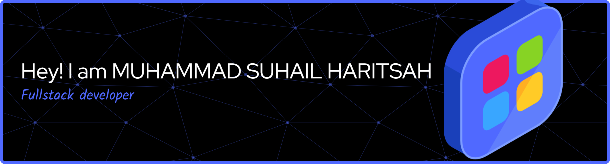

### 💫 About Me:

I'm an experienced Full-stack Web Developer, skilled in building dynamic and scalable web applications. On the backend, I'm proficient with PHP and Laravel, which helps me design and implement robust APIs and efficient server-side architectures. I also have hands-on experience working with MySQL and SQLite for effective data management.

### 🌐 Socials:

  

### 💻 Tech Stack:

        

###

 

<picture>
  <source media="(prefers-color-scheme: dark)" srcset="https://raw.githubusercontent.com/suhailharitsah/suhailharitsah/output/pacman-contribution-graph-dark.svg">
  <source media="(prefers-color-scheme: light)" srcset="https://raw.githubusercontent.com/suhailharitsah/suhailharitsah/output/pacman-contribution-graph.svg">
  
</picture>
